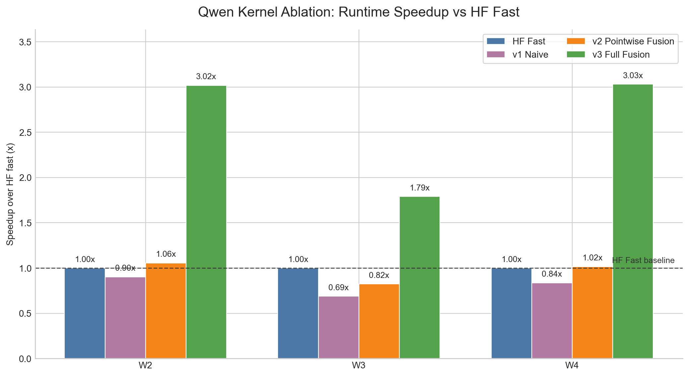

# Milestone 2 Results

For milestone 2, I hand wrote kernels for Qwen2.5-VL preprocessing. I implemented the same algorithm with three different schedules, and found significant improvements in performance based on schedule choice. From these results, we can inform the set of operations that are most important for designing a DSL. In addition, I polished some elements of the benchmarking harness with a new workload and exploring torch compile.

# Improvements to Benchmarking Harness since Milestone 1

I decided to add a new workload: W2. W2 is a simple batch of 32 1024x1024 images. It is meant to be a "standard" workload that has smaller images than W4 but also uniform unlike W3. 

I also did more research into InternVL2.5. I found that the most recent version, InternVL3.5, is fully supported by huggingface and includes a fast and legacy version. In the charts below, I include InternVL3.5 Legacy and InternVL3.5 Fast, and I kept InternVL2.5 Manual. The preprocessing is not significantly different between InternVL2.5 and 3.5. I included a new file `links.md` that outlines the official papers, links to github code, and huggingface model cards for each model.

The benchmarking harness now also supports multi-threaded execution as well as torch compile for the huggingface functions. I upgraded `benchmarks\full_benchmark.py` with these changes to evaluate profiling and runtimes, and `benchmarks\full_memory_benchmark.py` for memory. In the experiments below, I implemented `benchmarks\bench_kernels.py` to specifically benchmark my Qwen kernels against the huggingface Qwen implementations on both runtime and memory.

Full runtime and memory results for all models (Qwen Legacy/Fast, InternVL2.5 Manual, InternVL3.5 Legacy/Fast, LLaVA Fast/Legacy) are shown in the appendix at the bottom of this report.

# Hand-Crafted Qwen Preprocessing Numba Kernels

## Different Schedule, Same Algorithm

I tested three separate kernels, each implementing the Qwen2.5-VL preprocessing algorithm, but with different schedules. The kernel implementations are in `kernels/`.

The first version (v1), in `kernels/qwen_v1_naive.py` is a naive implementation of the kernel. We apply each operation in order:   bilinear_resize  →  rescale  →  normalize  →  patchify. In between each operation, we dump the entire output to a buffer in memory, to input to the next operation.

The second version (v2), in `kernels/qwen_v2_fused.py` optimizes the pipeline by fusing pointwise operations. The rescale and normalize operations are pointwise, so we can perform them at the same time as we compute the bilinear resize. The new set of operations are _resize_normalize  →  patchify. The performance of the pointwise fusion explored the effects of a `compute_at` Halide-like primitive.
 
The third version (v3), in `kernels/qwen_v3_storage.py` further optimizes with full fusion of the operations. The output memory is preallocated, and the function will fill each entry directly without intermediate buffers. Full fusion explores a possible `store_at` primitive as well as a `preallocate_output` primitive. 

v3 was also tested with numba parallelism per image and batch, and we analyze its performance with multiple threads. 

### Testing and Caveats

After each implementation version, I verified the correctness of the algorithm in the code in `tests/test_correctness.py`. Given the same randomized input image, I computed the difference in the output between algorithms, and verified they were identical up to floating point errors (1e-7). 

A key note about the implementation: Qwen uses a bicubic kernel with anti-aliasing for its resize. I decided that this would be too complicated to implement for this milestone. Instead, I implemented a bilinear kernel without anti-aliasing, which is much simpler but also faster to run. Using a smooth image input without significant variations that is not significantly affected by the kernel for resizing, I verified that my code returns the same output up to 1e-7 error. I also benchmarked the Huggingface implementation of Qwen using a bilinear resizing kernel instead of bicubic, which mitigated the difference in computation but was not perfect. Thus, take the performance differences with a grain of salt.

## Results

We benchmarked the runtime and peak memory allocation of the three versions of the Qwen kernel, against the huggingface implementation. We compared the legacy and fast implementation of huggingface, as well as the fast implementation with bilinear resizing. The runtime values reported are the median over 30 runs, after 10 warmup runs.

The visualization below summarizes the key result. Our v3 kernel outperforms huggingface fast. In addition, v3 outperforms v2 which outperforms v1.

### Chart 1: Runtimes per Workload
Median runtime in ms/img. Best model per workload is bolded.

| Workload | hf_legacy | hf_fast | hf_bilinear | v1 | v2 | v3 |
|---|---:|---:|---:|---:|---:|---:|
| W2 | 98.685 | 120.409 | 120.357 | 133.317 | 113.972 | **39.887** |
| W3 | 37.572 | 32.304 | 32.125 | 46.904 | 39.235 | **18.054** |
| W4 | 836.589 | 1013.734 | 1011.957 | 1212.327 | 997.460 | **334.576** |

### Chart 2: Peak Memory Allocation
Peak / Output RSS memory usage as a multiple of output bytes. Best model per workload is bolded.

| Workload | hf_legacy | hf_fast | hf_bilinear | v1 | v2 | v3 |
|---|---:|---:|---:|---:|---:|---:|
| W2 | 2.09x | 3.87x | 3.76x | 1.94x | 1.93x | **1.00x** |
| W3 | 1.96x | 2.29x | 2.33x | 1.86x | 1.75x | **1.00x** |
| W4 | 2.02x | 3.86x | 3.84x | 2.19x | 2.06x | **1.06x** |

### Discussion

In terms of runtime, we can see that the fully fused and memory optimized kernel v3 is able to outperform all huggingface implementations. We further observe improvement between v1 and v2 as well as v2 and v3 showing that scheduling choices like pointwise fusion and full fusion / output memory preallocation improves the performance of the program even if the underlying operations are the same.

Furthermore, we found that peak memory allocation for v3 was 1x the output size, meaning that no wasteful buffers were created during computation and memory footprint was streamlined. The memory and runtime results for v3 both show superiority over huggingface's implementations, and we can conclude that scheduling matters for program performance in both memory and runtime.

## Further Experiments

### Chart 3: Multi-threaded performance

Median runtime in ms/img with `--num-threads 8`. Best model per workload is bolded.

| Workload | hf_legacy | hf_fast | hf_bilinear | v1 | v2 | v3 |
|---|---:|---:|---:|---:|---:|---:|
| W2 | 88.679 | 42.852 | 42.312 | 123.618 | 112.766 | **42.228** |
| W3 | 37.651 | 13.092 | **12.666** | 48.779 | 44.683 | 19.465 |
| W4 | 948.411 | 374.803 | 372.580 | 1205.010 | 985.119 | **353.863** |

### Chart 4: Torch Compile Runtimes

Median runtime in ms/img. Best model per workload is bolded.

| Workload | hf_legacy | hf_legacy_compile | hf_fast | hf_fast_compile |
|---|---:|---:|---:|---:|
| W2 | 98.685 | **86.853** | 120.409 | 277.863 |
| W3 | 37.572 | 34.403 | **32.304** | 100.328 |
| W4 | **836.589** | 866.885 | 1013.734 | 2141.548 |

### Discussion

The third chart shows that, with 8 threads, the fast huggingface implementation significantly outperforms its single threaded implementation. It outperforms v3 on the W3 workload, but not on the W2 or W4 workload. However, note that the v3 kernel was not fully optimized for parallelism; we have parallelism over images, not output pixels. The huggingface fast implementation has more sophisticated per-pixel parallelism with tensors. This is an area for further experimentation, with a possible parallelization axis for the DSL. However, it is significant that our optimized scheduling in v3 is able to outperform the pytorch optimized fast version of huggingface on several workloads only with parallelism per image. 

In the fourth chart, we experimented with torch compile. Numba compiles its python code in our v1-v3 implementations, so we wanted to experiment with letting torch do the same. However, performance with torch compile was significantly worse. I believe this is because, even in the huggingface fast implementation using the torchvision backend, PIL functions are interleaved with tensor operations. This means that the compilation graph is unable to compile the function end to end, and instead compiles up to the PIL operation, then after it. The PIL operations significantly hamper the performance gain from compilation. These results further motivate the need for an integrated DSL that uses the same stack which results in clearer computation graphs and better compilation.

## DSL Insights

While we found performance gains from `compute_at` in v2, runtime only improved modestly and memory usage remained high. We find that `store_at` is the dominant primitive for this pipeline, with the most significant performance gains from v2 to v3. And, v3 outperforms the baseline in runtime and with perfect 1x intermediate memory usage. 

From our multi-threading experiments, we find that we should expand parallelization from per image to per pixel to get the most gain from multiple threads. I can look into a `parallel` primitive in the DSL that implements this, time permitting.

We also found that fragmenting the backend between PIL and pytorch caused significant performance loss for torch compile. This further justifies the need for a DSL with a unified backend to fully utilize JIT compilation.

# Conclusion
We found that implementing an optimized schedule leads to up to 3x performance improvement compared to existing implementations on a specific case study of the Qwen2.5-VL. Our experiments jusify moving forwards with a general DSL for VLM pre-processing.

We find that the algorithm itself is not the bottleneck for performance. It is in fact the schedule of that algorithm; a naive implementation is up to 3x slower. Furthermore, the most important DSL scheduling choices are output preallocation / full fusion, then parallelization axis, then pointwise fusion. We will implement these key primitives into our DSL, and we can now compare the DSL performance to our fully optimized hand-written kernel.

# Appendix

Here we attach updated versions of the Milestone 1 charts. We now include workload W2 and InternVL3.5, and compare single versus multi-threaded.

## Chart A1: Runtimes, Single-Threaded

Median runtime in ms/img. Best model per workload is bolded.

| Workload | Qwen Fast | Qwen Legacy | InternVL2.5 Manual | InternVL3.5 Legacy | InternVL3.5 Fast | LLaVA Fast | LLaVA Legacy |
|---|---:|---:|---:|---:|---:|---:|---:|
| W2 | 114.956 | 81.322 | 95.687 | 135.192 | 106.103 | **24.071** | 50.830 |
| W3 | 42.037 | 53.807 | 103.369 | 75.622 | 55.974 | **25.549** | 51.560 |
| W4 | 1458.948 | 1402.200 | 314.543 | 277.693 | 224.260 | **71.358** | 311.825 |

## Chart A2: Peak Memory Allocation, Single-Threaded

Peak / Output RSS memory usage. Best model per workload is bolded.

| Workload | Qwen Fast | Qwen Legacy | InternVL2.5 Manual | InternVL3.5 Legacy | InternVL3.5 Fast | LLaVA Fast | LLaVA Legacy |
|---|---:|---:|---:|---:|---:|---:|---:|
| W2 | 3.77x | 2.13x | **1.89x** | 2.03x | 2.77x | 2.53x | 3.00x |
| W3 | 2.28x | 1.91x | 1.85x | **1.83x** | 2.73x | 2.77x | 2.65x |
| W4 | 3.83x | 2.02x | **1.36x** | 1.55x | 4.07x | 6.10x | 5.65x |

## Chart A3: Runtimes, 8 Threads

Median runtime in ms/img with `--num-threads 8`. Best model per workload is bolded.

| Workload | Qwen Fast | Qwen Legacy | InternVL2.5 Manual | InternVL3.5 Legacy | InternVL3.5 Fast | LLaVA Fast | LLaVA Legacy |
|---|---:|---:|---:|---:|---:|---:|---:|
| W2 | 42.283 | 89.908 | 67.258 | 129.899 | 47.251 | **14.212** | 56.343 |
| W3 | 11.565 | 36.133 | 38.658 | 71.333 | 28.296 | **10.160** | 38.120 |
| W4 | 410.763 | 934.694 | 183.376 | 264.615 | 155.264 | **54.373** | 220.660 |

## Chart A4: Peak Memory Allocation, 8 Threads

Peak / Output RSS memory usage with `--num-threads 8`. Best model per workload is bolded.

| Workload | Qwen Fast | Qwen Legacy | InternVL2.5 Manual | InternVL3.5 Legacy | InternVL3.5 Fast | LLaVA Fast | LLaVA Legacy |
|---|---:|---:|---:|---:|---:|---:|---:|
| W2 | 3.77x | 2.13x | 1.93x | **1.89x** | 2.78x | 3.48x | 2.87x |
| W3 | 1.53x | **1.31x** | 1.37x | 1.44x | 2.50x | 1.75x | 1.64x |
| W4 | 3.75x | 2.02x | 1.00x | **0.00x** | 2.76x | 1.19x | 1.00x |

Note: the 8-thread W4 InternVL3.5 Legacy memory result reported `0.00x`, which means we might have had an error in our memory measurement for this value.