# Final Results Visualization Gallery

These figures are generated by `visualizations/final_results_charts.py` from the AWS result tables in `results/aws/`.

## Qwen Single-Thread Headline

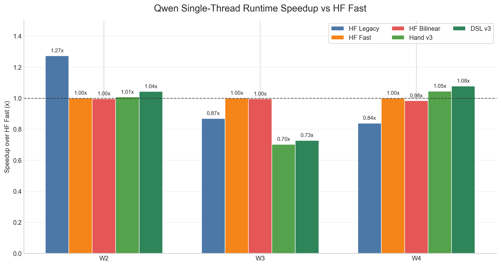

**Caption:** On one thread, the Qwen DSL result is a more modest runtime story: DSL v3 improves W2/W4 over HF Fast, but W3 remains slower, making this a useful honesty slide.

## Qwen Multi-Thread Headline

**Caption:** On the 8-thread AWS run, DSL v3 beats the parallel HF Fast Qwen baseline across W2/W3/W4 while staying close to the hand-written v3 kernel.

## Qwen Thread Scaling

**Caption:** DSL v3 scales by roughly 5.4-7.0x from one thread to eight threads, which is stronger than the HF Fast baseline and explains why the multi-thread setting is the cleanest headline result.

## DSL Schedule Ablation, Single Thread

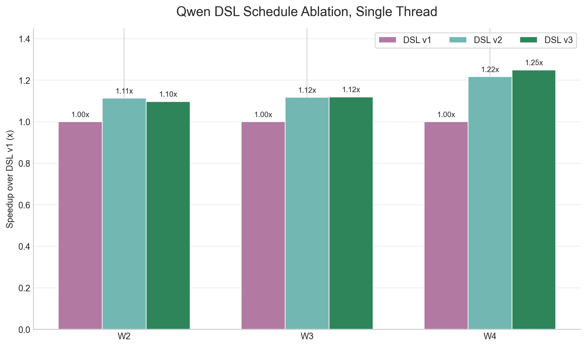

**Caption:** In single-thread mode, schedule changes mainly show modest fusion benefits: v2/v3 are usually about 1.1-1.25x over DSL v1.

## DSL Schedule Ablation, 8 Threads

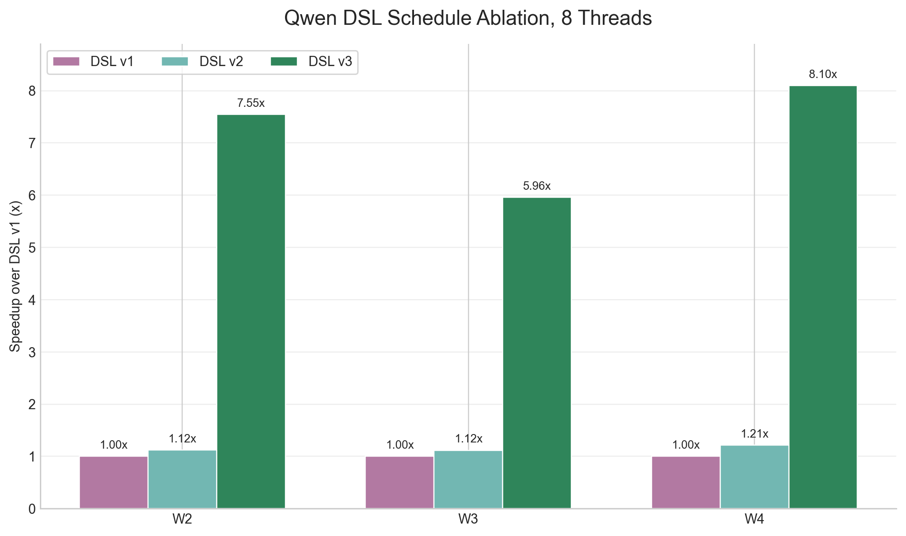

**Caption:** In 8-thread mode, the same schedule axis becomes dramatic: DSL v3 is about 6-8x faster than DSL v1 on the same Qwen algorithm.

## Runtime/Memory Pareto

**Caption:** DSL v3 moves Qwen preprocessing toward the lower-left corner: faster runtime and near-output-only peak memory, while HF Fast remains above 1.8-3.9x peak/output memory.

## HF Fast Pipeline Runtime

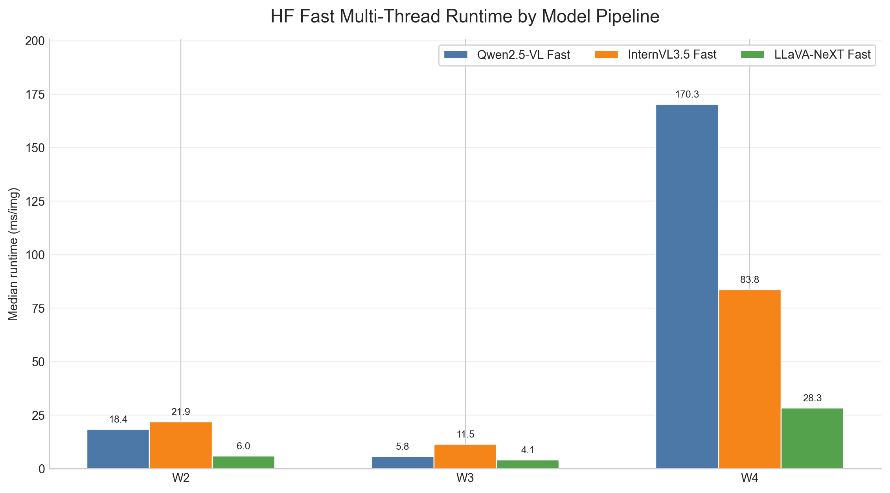

**Caption:** The multi-thread HF Fast baseline has very different runtime profiles across model families and workloads; this is useful context for why raw cross-model speed comparisons need care.

## HF Fast Pipeline Memory

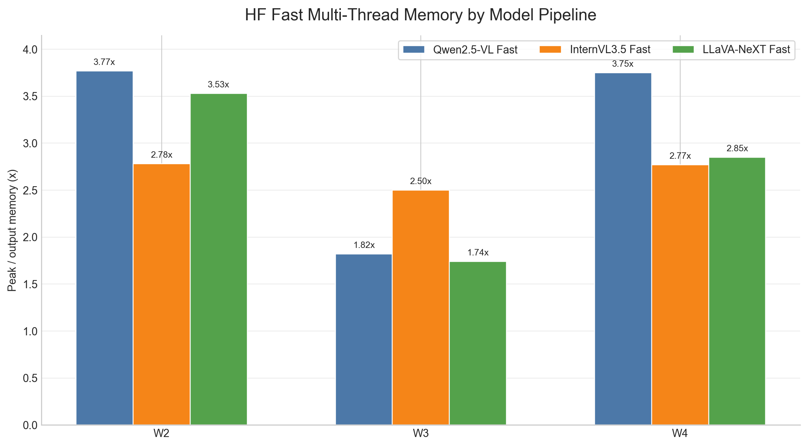

**Caption:** The same multi-thread HF Fast implementations still use multiple times output memory across most model/workload pairs.

## W2 Runtime Baselines

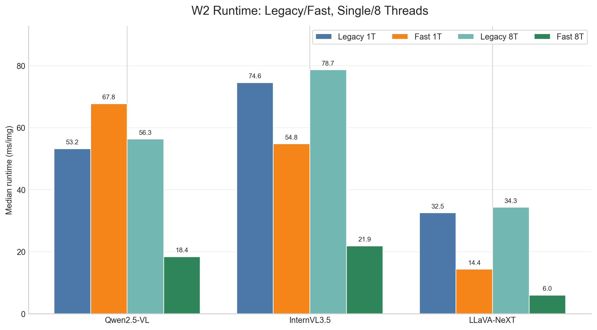

**Caption:** For W2, HF Fast improves substantially with 8 threads across Qwen, InternVL, and LLaVA, while legacy paths mostly remain slower.

## W3 Runtime Baselines

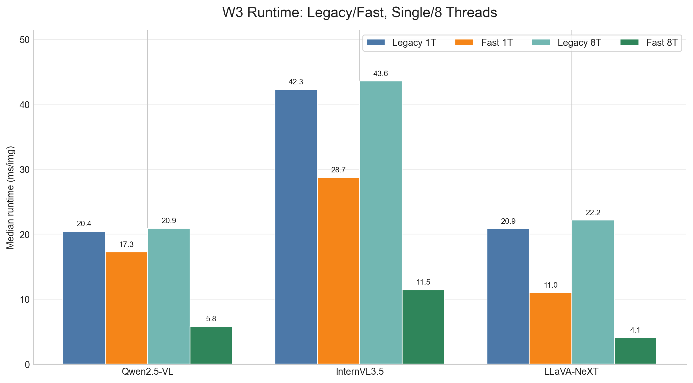

**Caption:** For W3, the 8-thread fast implementations are the strongest HF baselines for all three model families.

## W4 Runtime Baselines

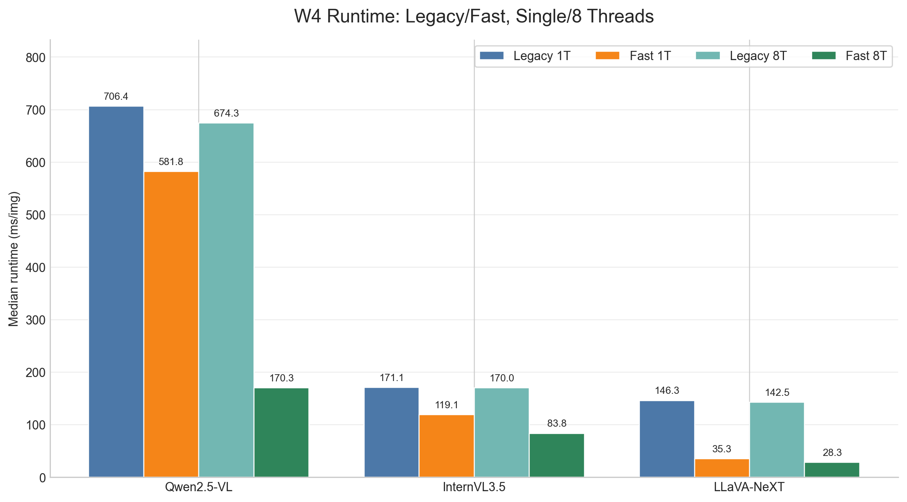

**Caption:** For W4, Qwen remains the heaviest HF Fast runtime, while InternVL and LLaVA have smaller output footprints and lower per-image runtime.

## W2 Memory Baselines

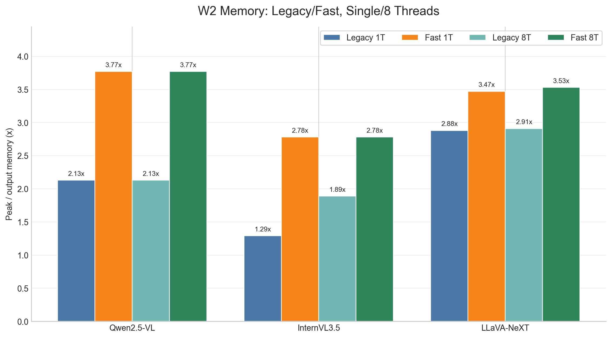

**Caption:** For W2, HF Fast improves runtime but generally has higher peak/output memory than the corresponding legacy path.

## W3 Memory Baselines

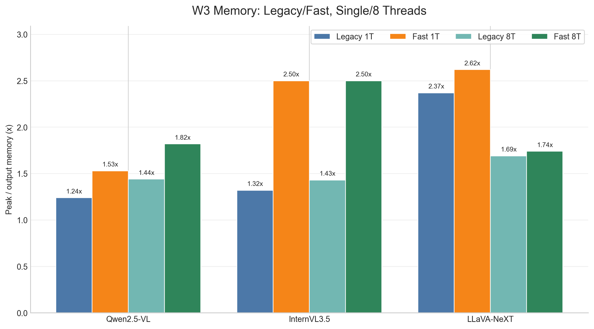

**Caption:** For W3, memory overhead is lower than W2/W4 for Qwen and LLaVA, but HF Fast still carries extra peak/output memory.

## W4 Memory Baselines

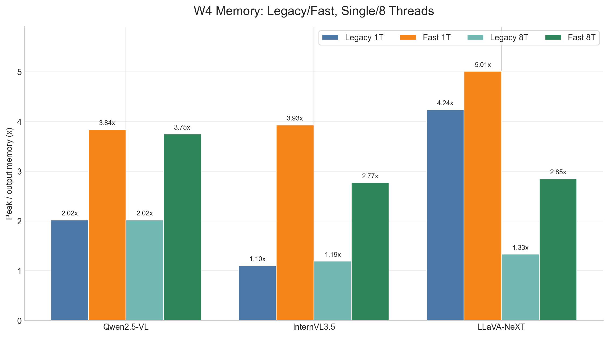

**Caption:** For W4, HF Fast memory overhead remains high for Qwen and InternVL, while LLaVA legacy has the lowest peak/output ratio but not the best runtime.

## HF Fast Memory Motivation

**Caption:** Even after enabling multi-threaded HF Fast implementations, peak memory is still commonly several times larger than the output tensor across Qwen, InternVL, and LLaVA.

## HF Fast Thread Scaling Context

**Caption:** HF Fast does benefit from multi-threading, but the scaling varies substantially across model families and workloads, which motivates a schedule-oriented view of preprocessing performance.
