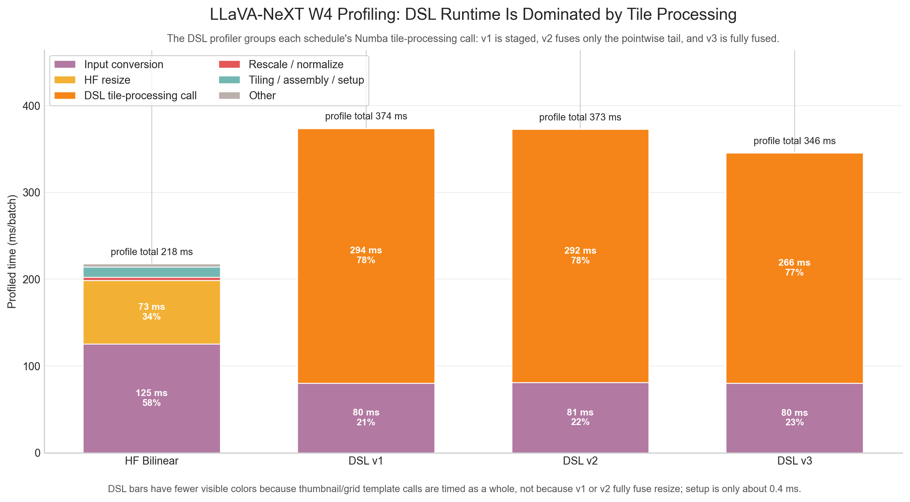
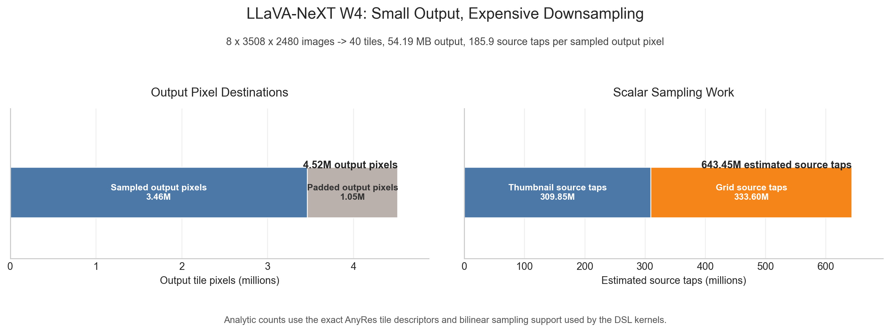

# Final Results Visualization Gallery

These figures are generated by `visualizations/final_results_charts.py` from the tables in `FINAL_RESULTS.md`, plus focused profiling figures from `visualizations/llava_w4_profiling_charts.py`.

## Multi-Thread Runtime

## Multi-Thread Peak Memory

## Single-Thread Runtime

## Single-Thread Peak Memory

## Runtime/Memory Pareto

## LLaVA-NeXT W4 Profiling

The DSL bars have fewer categories because the profiler times each schedule's thumbnail and grid template calls as grouped units. LLaVA DSL v1 is staged, v2 fuses only the pointwise tail after resize, and v3 is fully fused.

