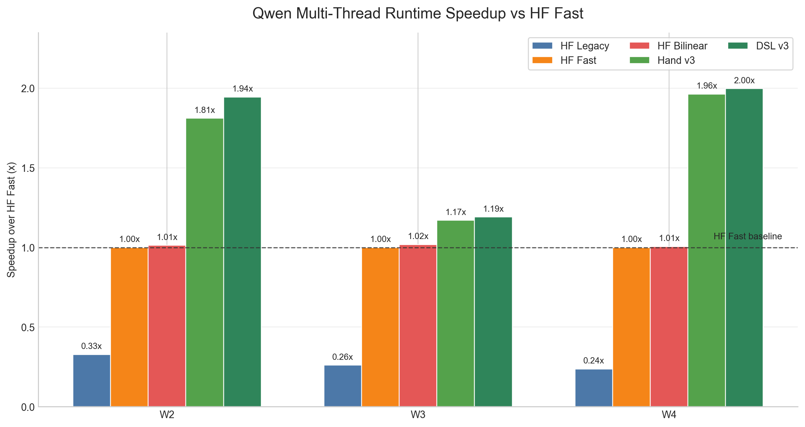
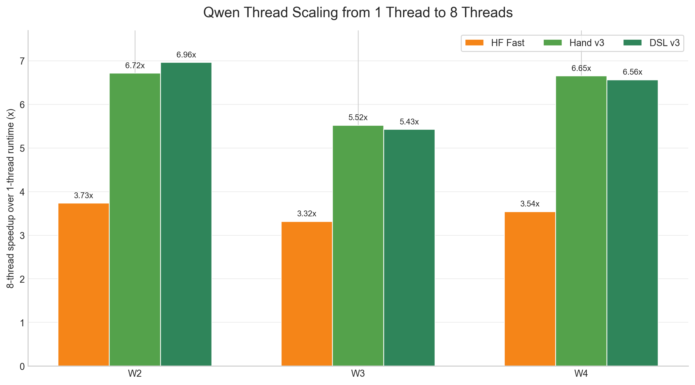
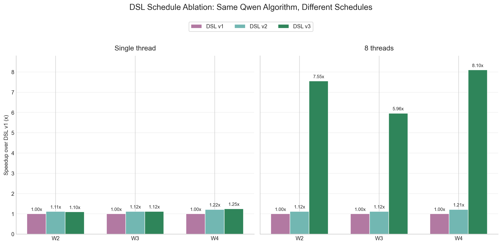
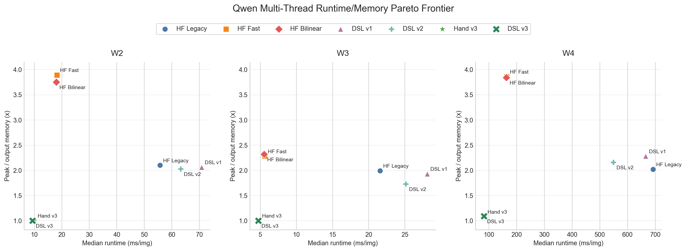
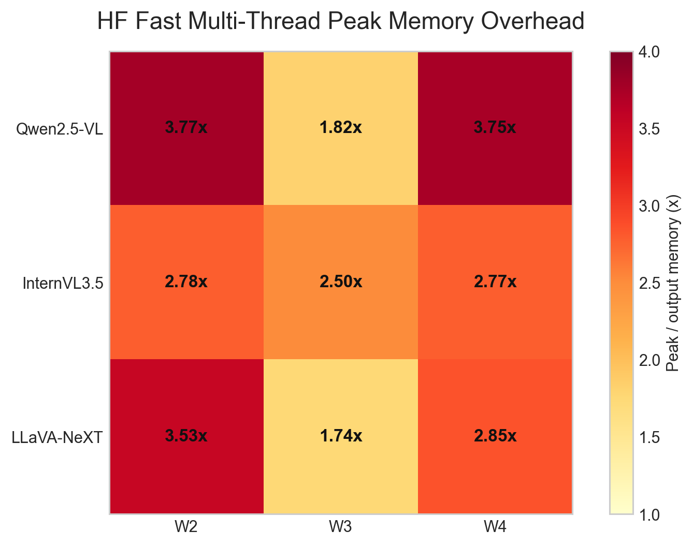
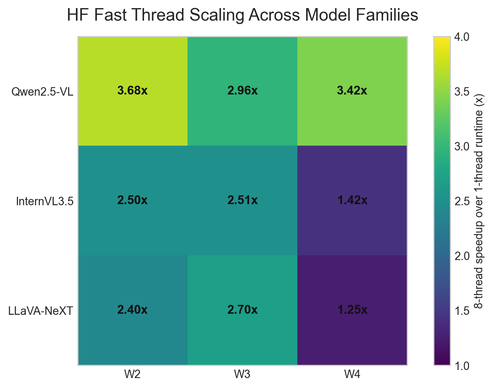

# Final Results Visualization Gallery

These figures are generated by `visualizations/final_results_charts.py` from the AWS result tables in `results/aws/`.

## Qwen Multi-Thread Headline

**Caption:** On the 8-thread AWS run, DSL v3 beats the parallel HF Fast Qwen baseline across W2/W3/W4 while staying close to the hand-written v3 kernel.

## Qwen Thread Scaling

**Caption:** DSL v3 scales by roughly 5.4-7.0x from one thread to eight threads, which is stronger than the HF Fast baseline and explains why the multi-thread setting is the cleanest headline result.

## DSL Schedule Ablation

**Caption:** Varying only the DSL schedule produces a large performance spread on the 8-thread run: DSL v3 is about 6-8x faster than DSL v1 on the same Qwen algorithm.

## Runtime/Memory Pareto

**Caption:** DSL v3 moves Qwen preprocessing toward the lower-left corner: faster runtime and near-output-only peak memory, while HF Fast remains above 1.8-3.9x peak/output memory.

## HF Fast Memory Motivation

**Caption:** Even after enabling multi-threaded HF Fast implementations, peak memory is still commonly several times larger than the output tensor across Qwen, InternVL, and LLaVA.

## HF Fast Thread Scaling Context

**Caption:** HF Fast does benefit from multi-threading, but the scaling varies substantially across model families and workloads, which motivates a schedule-oriented view of preprocessing performance.
