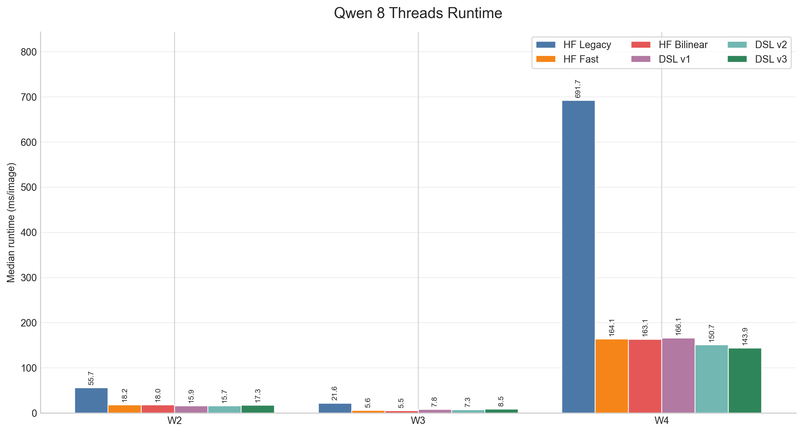
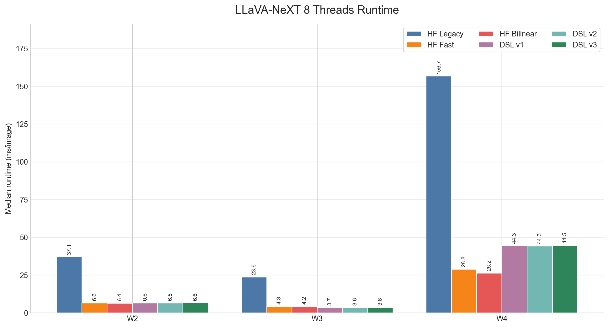
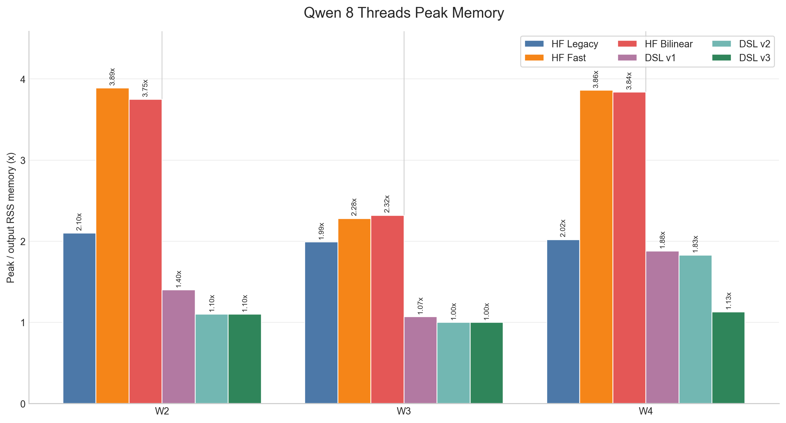
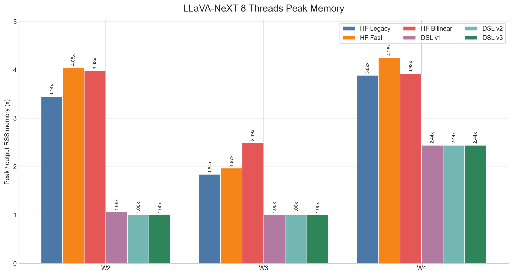
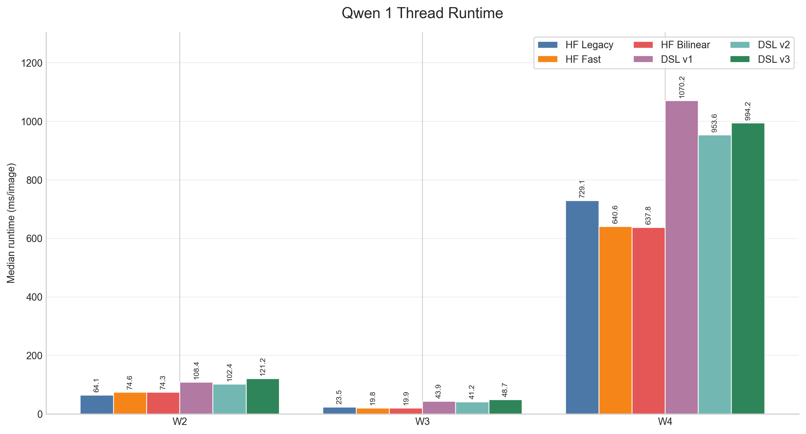
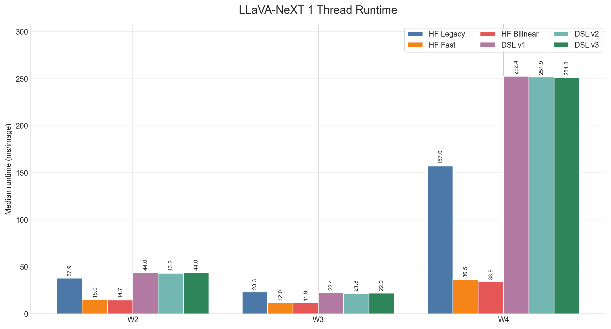
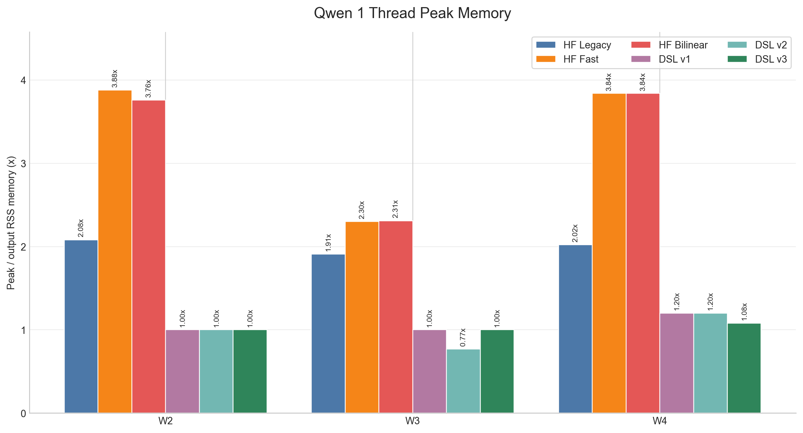
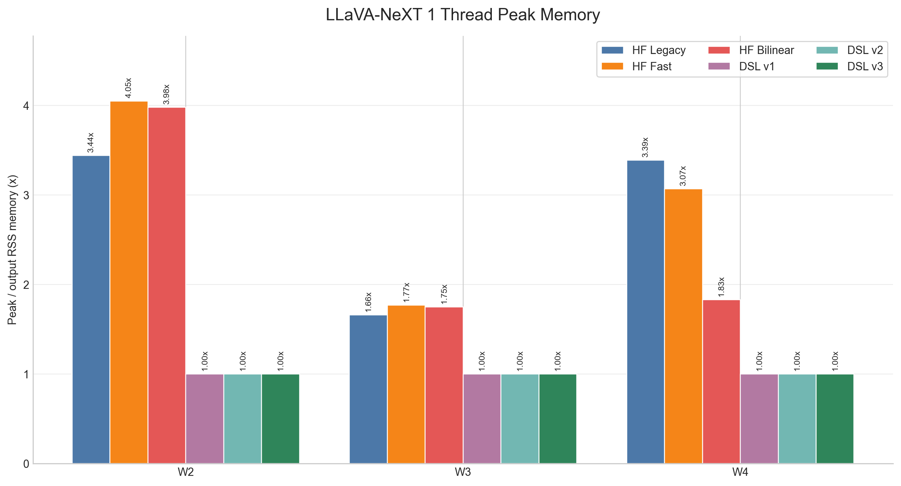
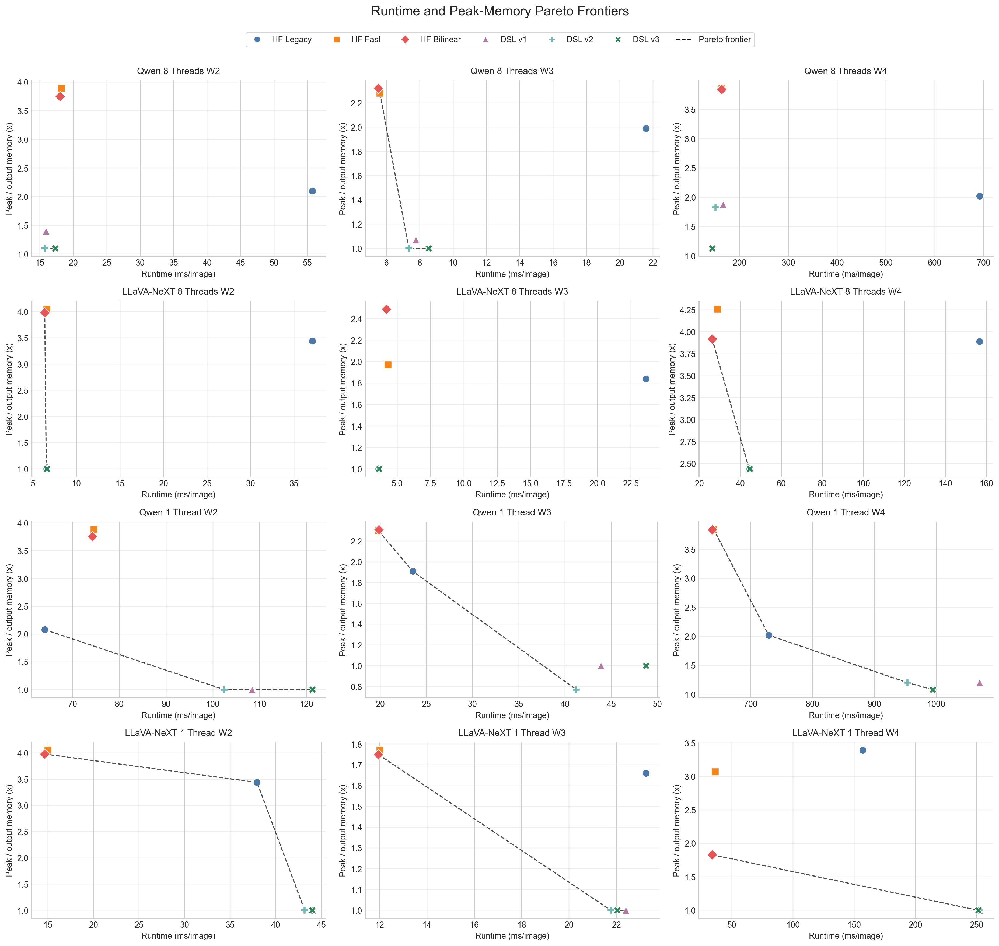

# Final Results Visualization Gallery

These figures are generated by `visualizations/final_results_charts.py` from the tables in `FINAL_RESULTS.md`.

## Multi-Thread Runtime

## Multi-Thread Peak Memory

## Single-Thread Runtime

## Single-Thread Peak Memory

## Runtime/Memory Pareto

