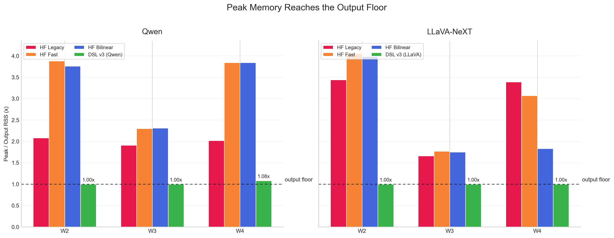
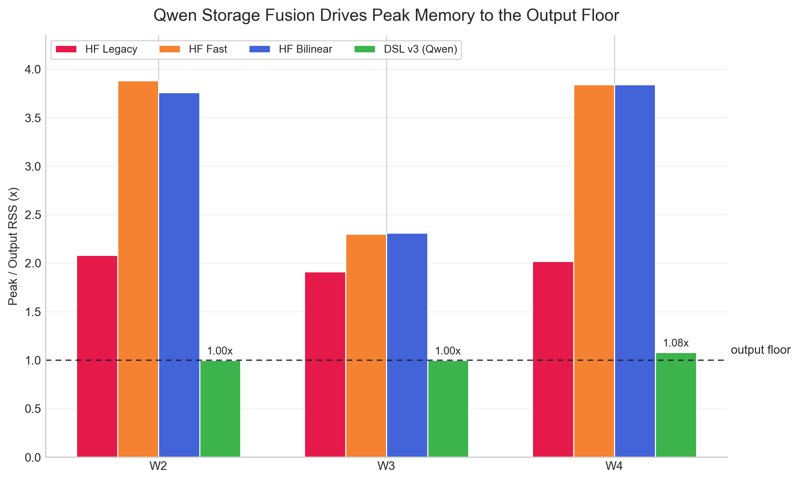
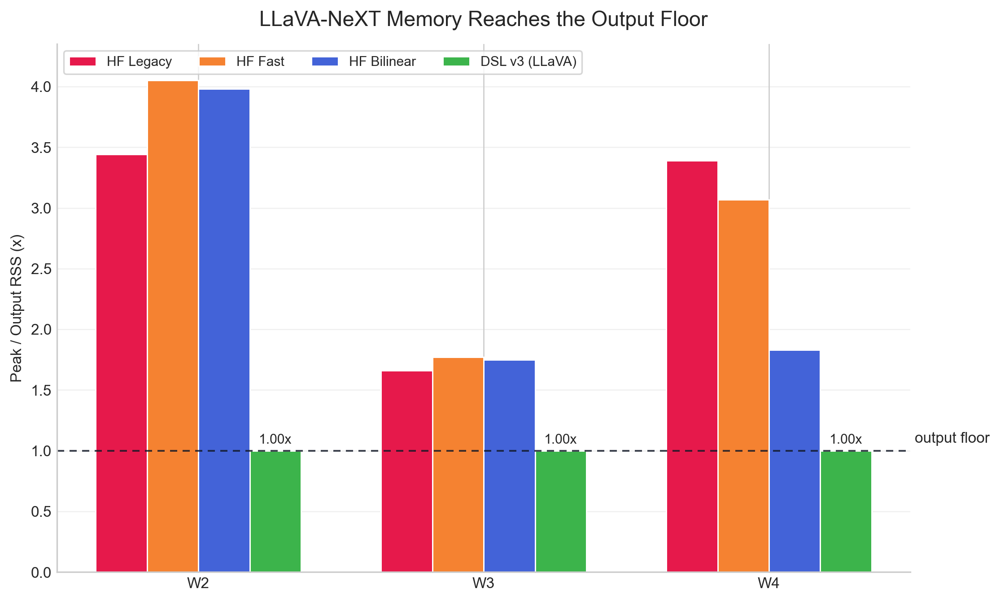
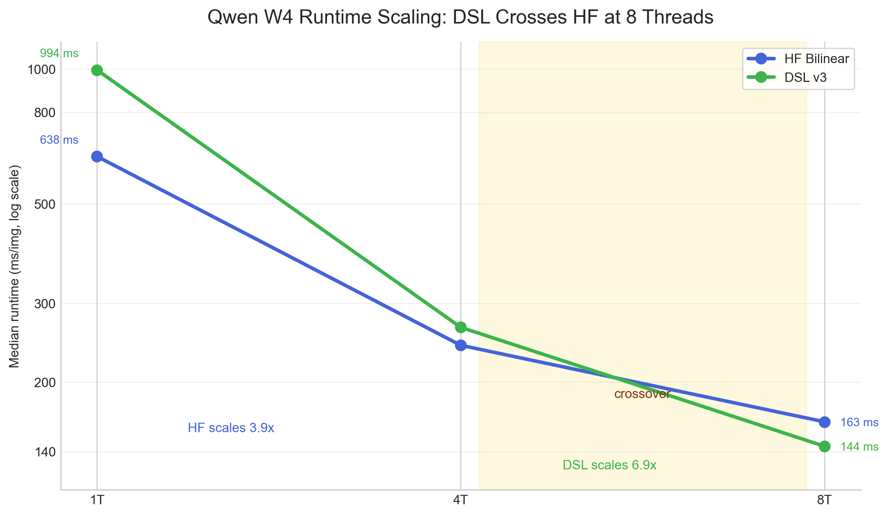
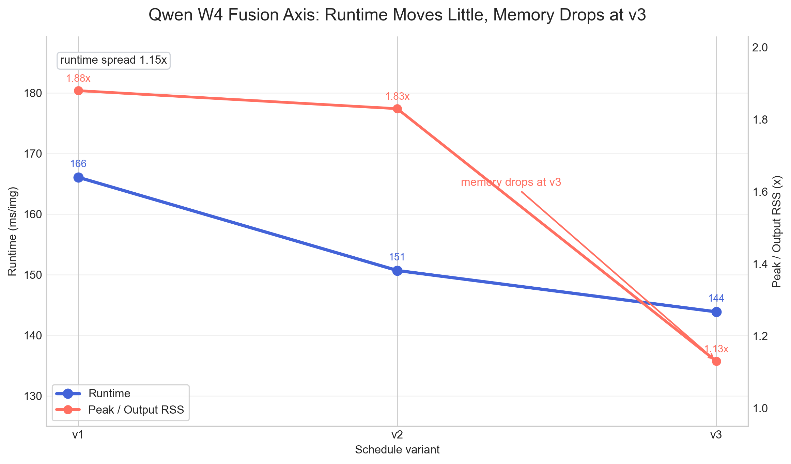
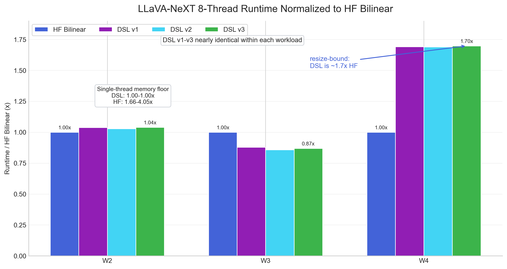

# Final Slide Data Figures

These figures are generated by `visualizations/final_slide_figures.py` from the tables in `FINAL_RESULTS.md`.

## Slide 5: Memory Floors

## Slide 5 Individual: Qwen Memory Floor

## Slide 5 Individual: LLaVA Memory Floor

## Slide 6: Qwen W4 Thread Scaling

## Slide 7: Qwen Schedule Axes

## Slide 8: LLaVA Schedule Boundary

